<h1 align="center">Alicia Sykes - CV</h1>
<p align="center">
<a href="https://github.com/Lissy93/cv"><br /></a>
<i>This repo contains the source for my personal CV</i>
<br />
<i>A website (Svelte) and PDF (LaTeX) auto-built from jsonresume data</i>
<br />
<b>🌐 <a href="https://cv.aliciasykes.com/">cv.aliciasykes.com</a> | 📄 <a href="https://cv.aliciasykes.com/download"><code>Alicia-Sykes-CV.pdf</code></a></b> <br />
</p>


## Motive
To automate my CV generation, and make it easier to maintain.
All content defined in YAML, then a script generates a LaTeX PDF and deploy a web version.
I did it this way so that I don't need to f\*\*k around with Microsoft Word.

<details>
  <summary>Motive (legacy)</summary>


> **Backstory**<br>
> I'm just about to be made redundant 😢 (Aug '24), which I am gutted about. I've never been laid off before, and I loved my job and the people I worked with. So I'm now on the market, looking for a new role!
>
> I've kept my CV/resume **very** brief, in an attempt respect the hiring manager's time. But in short, I'm an experienced, Principle-level full stack engineer with a love for quality, performance, mentoring, tech and open source. The best judge of a developer is their code, and while I cannot share what I've done professional or for private clients, I have got many open source projects on my [GitHub](https://github.com/lissy93) and at [apps.aliciasykes.com](https://apps.aliciasykes.com).

  
</details>

---

## About

The resume content is defined in [`resume.yml`](/resume.yml) following the [jsonresume.org](https://jsonresume.org/) standard, and validated against [`schema.json`](/schema.json).
A LaTex document is then generated from [`template.jinja`](/template.jinja) formated with [`resume-format.cls`](/tex/resume-format.cls), which is then [compiled into a PDF](https://github.com/Lissy93/cv/actions/workflows/compile.yml) by GitHub Actions, and published under the [Releases](https://github.com/Lissy93/cv/releases) tab.
A markdown version is also generated by [`lib/markdown.py`](/lib/markdown.py), as well as a CV website which is built as a static site with SvelteKit, and deployed to GitHub Pages and Vercel, at [cv.aliciasykes.com](https://aliciasykes.com).

Why? ...Because why spend 30 minutes writing your CV, when you could spend 30 hours automating it, obviously!


---

## Usage

### Option #1 - GitHub
1. Fork the repo
2. Update resume.json with your own content
3. Create [a tag](/.github/workflows/tag.yml), or trigger the GH actions workflow
4. ....and a PDF and website gets magically generated
5. View the PDF in the [Releases](https://github.com/Lissy93/cv/releases) tab, and the website source in the [`website`](https://github.com/Lissy93/cv/tree/website) branch, or deployed to GitHub Pages (for me, this is [cv.aliciasykes.com](https://cv.aliciasykes.com))

---

### Option #2 - Local
See the [`Makefile`](/Makefile) for all the available commands. Or, just run `make` from the root, to install deps, validate content, generate LaTex, and compile PDF

1. Clone the repo
2. Update resume.json with your own content
1. Run `make` from the root, to install deps, validate content, generate LaTex, and compile PDF

Or, to deploy the web version
1. Follow steps above (clone, edit, validate)
2. Run `make web` to generate `dist/`
3. upload to any CDN, web server or static hosting provider (I use Vercel)

<details><summary>Commands</summary>

- `make install` - Download dependencies
- `make validate` - Validate content
- `make generate` - Generate LaTex
- `make compile` - Compile PDF
- `make clean` - Remove generated files
- `make watch` - Watch for changes, recompile and refresh
- `make web` - Launches web version, installs NPM deps, builds and serves the site

```mermaid
flowchart LR
    GA([🤖 GitHub Actions<br><sup>Triggered on <code>resume.yml</code> change</sup>]) --> A3

    A1([🚀 Start<br><sup>Clone repo & cd into it</sup>]) --> A2[✏️ Update <code>resume.yml</code><br><sub>Your resume content goes here</sub>]
    A2 --> A3[✅ make validate<br><sub>Check for content or schema issues</sub>]

    %% PDF PATH
    A3 --> PDF[📄 PDF Output]
    PDF --> B1[📦 make install<br><sub>Install all dependencies</sub>]
    B1 --> B2[🛠 make generate<br><sub>Generate LaTeX from resume.yml</sub>]
    B2 --> B3[📄 make compile<br><sub>Compile LaTeX to PDF</sub>]
    B3 --> B4([✅ View at <code>out/resume.pdf</code>])

    %% WEB PATH
    A3 --> Web[🌐 Website Output]
    Web --> C1[🌐 make web<br><sub>Build static site into <code>./dist</code></sub>]
    Web --> C2[🧪 make web_dev<br><sub>Start local dev server at <code>localhost:5173</code></sub>]
    C1 --> C3([🚀 Deploy <code>./dist</code> to your host])
    C2 --> C4([🔍 View site locally in browser])
```

</details>



---

## Editing
Modify data by editing [`resume.yml`](/resume.yml)<br>
If you need to customize the layout, edit [`template.jinja`](/template.jinja)<br>
Or to change the styles and formatting, edit [`resume-format.cls`](/tex/resume-format.cls)<br>
All the scripts used to generate output are located in [`lib/`](/lib/)<br>
These are triggered either by the [`Makefile`](/Makefile) or via GitHub Actions with the [`workflows/`](/.github/workflows)<br>
The source for the website version is located in [`web/`](/web)

---

## Screenshot

<h3 align="center">Web 🌐</h3>
<p align="center"><a href="https://cv.aliciasykes.com"></a></p>

<h3 align="center">PDF 📄</h3>
<p align="center"><a href="https://cv.aliciasykes.com"></a></p>

---

## Status

| Workflow     | Description      | Status                     |
| :----------- | :--------------- | :------------------------: |
| `tag`        | Creates a new Git tag. Optionally specify the tag name and description, or by default it will just bump the sem ver patch number by 1 | [](https://github.com/Lissy93/cv/actions/workflows/tag.yml)  |
| `generate`   | Generates your resume in PDF form as an artifact. If triggered by a tag, then a new release will be created, with the PDF attatched   | [](https://github.com/Lissy93/cv/actions/workflows/compile.yml) |
| `validate`   | Validates your resume data against the schema. This will also run whenever a new PR is opened, to ensure it's valid and working | [](https://github.com/Lissy93/cv/actions/workflows/validate.yml) |
| `website`     | Compiles the web version as a SvelteKit interactive résumé site | [](https://github.com/Lissy93/cv/actions/workflows/build-site.yml) |
| `mirror`     | Backups up repository and content to our (non-Microsoft) Codeberg mirror | [](https://github.com/Lissy93/cv/actions/workflows/mirror.yml) |


---

## Contributing

### Pull Requests
No point contributing. Just fork the repo and do whatever changes you like there.

### Issues
No point in raising issues here. It works on my machine. Therefore I see no issue, lol

---
  

## Attributions

### Contributors


### Sponsors


---

## License

> _**[Lissy93/CV](https://github.com/Lissy93/cv)** is licensed under [MIT](https://github.com/Lissy93/cv/blob/HEAD/LICENSE) © [Alicia Sykes](https://aliciasykes.com) 2025._<br>
> <sup align="right">For information, see <a href="https://tldrlegal.com/license/mit-license">TLDR Legal > MIT</a></sup>

<details>
<summary>Expand License</summary>

```
The MIT License (MIT)
Copyright (c) Alicia Sykes <alicia@omg.com> 

Permission is hereby granted, free of charge, to any person obtaining a copy 
of this software and associated documentation files (the "Software"), to deal 
in the Software without restriction, including without limitation the rights 
to use, copy, modify, merge, publish, distribute, sub-license, and/or sell 
copies of the Software, and to permit persons to whom the Software is furnished 
to do so, subject to the following conditions:

The above copyright notice and this permission notice shall be included install 
copies or substantial portions of the Software.

THE SOFTWARE IS PROVIDED "AS IS", WITHOUT WARRANTY OF ANY KIND, EXPRESS OR IMPLIED,
INCLUDING BUT NOT LIMITED TO THE WARRANTIES OF MERCHANT ABILITY, FITNESS FOR A
PARTICULAR PURPOSE AND NON INFRINGEMENT. IN NO EVENT SHALL THE AUTHORS OR COPYRIGHT
HOLDERS BE LIABLE FOR ANY CLAIM, DAMAGES OR OTHER LIABILITY, WHETHER IN AN ACTION
OF CONTRACT, TORT OR OTHERWISE, ARISING FROM, OUT OF OR IN CONNECTION WITH THE
SOFTWARE OR THE USE OR OTHER DEALINGS IN THE SOFTWARE.
```

</details>

<!-- License + Copyright -->
<p  align="center">
  <i>© <a href="https://aliciasykes.com">Alicia Sykes</a> 2025</i><br>
  <i>Licensed under <a href="https://gist.github.com/Lissy93/143d2ee01ccc5c052a17">MIT</a></i><br>
  <a href="https://github.com/lissy93"></a><br>
  <sup>Thanks for visiting :)</sup>
</p>

<!-- Dinosaur -->
<!-- 
                        . - ~ ~ ~ - .
      ..     _      .-~               ~-.
     //|     \ `..~                      `.
    || |      }  }              /       \  \
(\   \\ \~^..'                 |         }  \
 \`.-~  o      /       }       |        /    \
 (__          |       /        |       /      `.
  `- - ~ ~ -._|      /_ - ~ ~ ^|      /- _      `.
              |     /          |     /     ~-.     ~- _
              |_____|          |_____|         ~ - . _ _~_-_
-->

